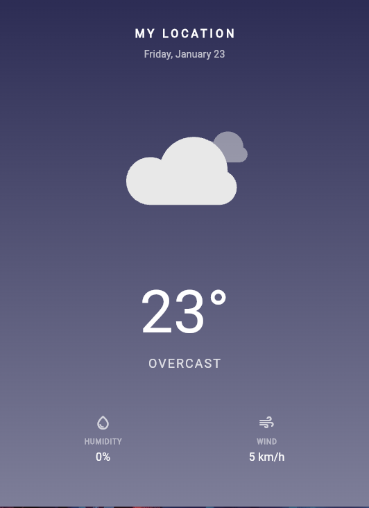

# 🌤️ Minimalist Weather App

A beautiful, clean, and minimalist weather application built with Flutter. This app provides real-time weather information with stunning animations and an intuitive user interface.

## ✨ Features

### 🎨 **Clean & Minimalist Design**
- Modern glassmorphism UI with subtle transparency effects
- Dynamic color schemes that adapt to weather conditions
- Day/night mode with automatic color switching
- Clean typography with proper visual hierarchy

## image



### 🌈 **Beautiful Animations**
- Smooth fade-in and slide-up animations
- Lottie animations for weather conditions
- Interactive button animations with haptic feedback
- Elastic scale animations for weather display

### 🌍 **Weather Information**
- Real-time weather data from Open-Meteo API
- Current temperature with "feels like" temperature
- Wind speed and humidity information
- Automatic location detection with city name
- Support for multiple weather conditions

### 📱 **User Experience**
- Pull-to-refresh functionality
- Tap-to-refresh with visual feedback
- Responsive design for different screen sizes
- Error handling with user-friendly messages
- Loading states with progress indicators

## 🛠️ Technologies Used

- **Flutter** - Cross-platform mobile development framework
- **Dart** - Programming language
- **Lottie** - Beautiful animations
- **Geolocator** - Location services
- **Geocoding** - Address lookup
- **HTTP** - API requests
- **Open-Meteo API** - Weather data source

## 📦 Dependencies

```yaml
dependencies:
  flutter:
    sdk: flutter
  cupertino_icons: ^1.0.8
  geolocator: ^14.0.1
  http: ^1.4.0
  geocoding: ^4.0.0
  lottie: ^3.3.1
  flutter_launcher_icons: ^0.14.4
```

## 🚀 Getting Started

### Prerequisites
- Flutter SDK (3.8.1 or higher)
- Dart SDK
- Android Studio / VS Code
- Android/iOS device or emulator

### Installation

1. **Clone the repository**
   ```bash
   git clone https://github.com/yourusername/flutter_weather_app.git
   cd flutter_weather_app
   ```

2. **Install dependencies**
   ```bash
   flutter pub get
   ```

3. **Run the app**
   ```bash
   flutter run
   ```

## 🎯 App Structure

```
lib/
├── main.dart                 # App entry point
├── pages/
│   └── weather_page.dart     # Main weather display page
├── models/
│   └── weather_model.dart    # Weather data model
└── services/
    └── weather_services.dart # API and location services

assets/
├── cloudy.json              # Cloudy weather animation
├── sunny.json               # Sunny weather animation
├── rainy.json               # Rainy weather animation
└── thunder.json             # Thunderstorm animation
```

## 🌟 Key Features Breakdown

### Dynamic Weather Backgrounds
The app automatically changes background colors based on:
- Current weather conditions
- Time of day (day/night mode)
- Weather intensity

### Weather Condition Support
- ☀️ Clear/Sunny
- ⛅ Partly Cloudy
- ☁️ Cloudy/Overcast
- 🌧️ Rain (Light, Moderate, Heavy)
- ⛈️ Thunderstorms
- 🌨️ Snow
- 🌫️ Fog

### Smooth Animations
- **Fade Animation**: Content appears smoothly
- **Slide Animation**: Elements slide up from bottom
- **Scale Animation**: Weather display with elastic effect
- **Interactive Animations**: Button press feedback

## 🔧 Configuration

### Location Permissions
The app requires location permissions to get current weather data. Make sure to:

**Android** (`android/app/src/main/AndroidManifest.xml`):
```xml
<uses-permission android:name="android.permission.ACCESS_FINE_LOCATION" />
<uses-permission android:name="android.permission.ACCESS_COARSE_LOCATION" />
```

**iOS** (`ios/Runner/Info.plist`):
```xml
<key>NSLocationWhenInUseUsageDescription</key>
<string>This app needs location access to show weather for your current location.</string>
```

## 🎨 Customization

### Colors
You can customize the app colors by modifying the `_getBackgroundColor()` method in `weather_page.dart`:

```dart
Color _getBackgroundColor(String? condition) {
  // Add your custom color logic here
}
```

### Animations
Modify animation durations and curves in the `_initializeAnimations()` method:

```dart
_fadeController = AnimationController(
  duration: const Duration(milliseconds: 1000), // Customize duration
  vsync: this,
);
```

## 📱 Screenshots

*Add your app screenshots here*

## 🤝 Contributing

1. Fork the repository
2. Create your feature branch (`git checkout -b feature/AmazingFeature`)
3. Commit your changes (`git commit -m 'Add some AmazingFeature'`)
4. Push to the branch (`git push origin feature/AmazingFeature`)
5. Open a Pull Request

## 📄 License

This project is licensed under the MIT License - see the [LICENSE](LICENSE) file for details.

## 🙏 Acknowledgments

- [Open-Meteo](https://open-meteo.com/) for providing free weather API
- [LottieFiles](https://lottiefiles.com/) for beautiful weather animations
- Flutter team for the amazing framework

## 📞 Contact

Your Name - [@yourusername](https://twitter.com/yourusername) - email@example.com

Project Link: [https://github.com/yourusername/flutter_weather_app](https://github.com/yourusername/flutter_weather_app)

---

⭐ **If you found this project helpful, please give it a star!** ⭐ 
